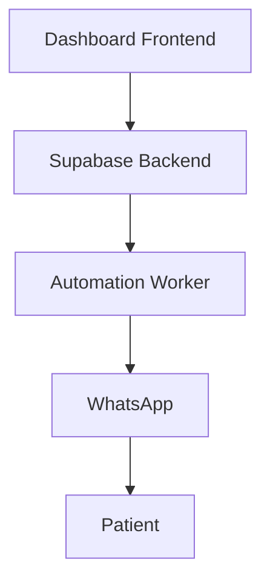

# Architecture Overview - PRN-Vigilante

## System Design

Tri-modular system designed for intelligent medical exam appointment management.



## Technology Stack

**Frontend**: React 18 + Vite + TypeScript  
**Backend**: Supabase (PostgreSQL, Edge Functions)  
**WhatsApp**: Evolution API  
**LLM**: OpenAI GPT-4o-mini

## Module Structure

```
automation/
├── src/
│   ├── core/ (worker-engine, queue-manager, humanizer)
│   ├── services/ (evolution, supabase)
│   ├── utils/ (helpers)
│   └── types/
```

## Key Decisions

- ADR-001: Tri-Modular Architecture
- ADR-002: Evolution API (multi-device)
- ADR-003: Supabase Edge Functions

## Performance

- Claim latency: < 50ms
- Humanizer delay: 3-13 minutes
- Retry: 3 attempts (exponential backoff)
- Database: 45 indexes, 22 FKs

## Data Flow

User → Dashboard → Supabase → Worker → Humanizer → Evolution → WhatsApp → Patient

## Known Issues

1. supabase.ts monolithic (1,142 lines)
2. N+1 query in runSecondCallRecovery
3. Missing index on send_after

Generated: 2026-03-20
