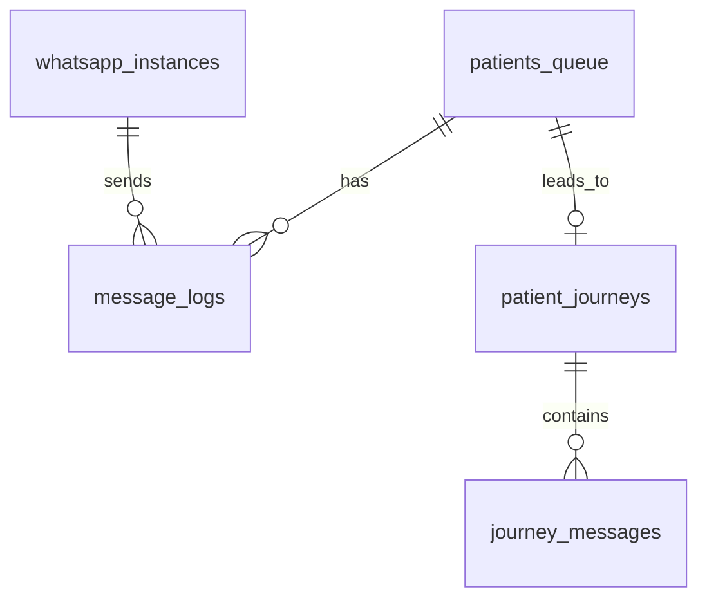

# Database Schema & Performance

## Tables (14 total)

### Core Tables
1. **patients_queue** (main queue)
   - 30+ columns: id, patient_name, phone, status, locked_by, instance_id
   - 13 indexes including unique constraints
   
2. **patient_journeys**
   - journey_id, patient_name, canonical_phone, status
   
3. **journey_messages**
   - message tracking within journeys

### Supporting Tables
4. **whatsapp_instances** - connected WhatsApp instances
5. **message_logs** - delivery history
6. **worker_heartbeats** - worker monitoring
7. **patient_consent** - LGPD compliance
8. **message_blocks** - opt-out blocks
9. **analytics_daily** - aggregates
10. **message_events** - event timeline
11. **webhook_events_raw** - inbound webhooks
12. **message_qualifications** - LLM classification
13. **system_config** - feature flags

## Indexes (45)

### Critical Indexes
- idx_patients_queue_claim (status, is_approved, send_after)
- idx_patients_queue_locks (locked_by, locked_at)
- idx_patients_queue_dedupe_hash_unique
- idx_message_events_daily (timezone-aware)

### Missing Indexes (PRIORITY HIGH)
```sql
CREATE INDEX CONCURRENTLY idx_patients_queue_send_after_simple 
ON patients_queue(send_after);

CREATE INDEX CONCURRENTLY idx_patients_queue_status_simple 
ON patients_queue(status) 
WHERE status IN ('queued', 'failed');
```

## Foreign Keys (22)

```
patients_queue → patient_journeys (journey_id)
message_logs → patients_queue (message_id)
journey_messages → patient_journeys (journey_id)
message_events → patients_queue (message_id)
```

## Performance Stats

- **claim**: < 50ms ✅
- **enqueue**: < 100ms ✅
- **archive**: < 500ms ✅
- **Throughput**: 200+ msgs/segundo

## RPC Functions

1. `claim_next_message(p_worker_id, p_max_attempts)`
2. `enqueue_patient(15 params)`
3. `release_expired_locks(p_timeout)`
4. `acquire_worker_lease(p_worker_id, p_lease_seconds)`
5. `cleanup_stale_heartbeats(p_minutes)`

## Schema Visualization



Created: 2026-03-20
